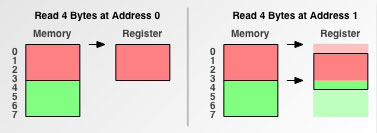
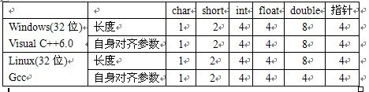

# 字节对齐

个人的理解：使基本数据类型的地址是类型大小的整数倍。
即对于基本数据类型: &a % sizeof(a) = 0

## 为什么要对齐

- 部分cpu不支持访问未对齐的数据
- 增加cpu访问内存效率
- ...

我们眼中内存可能是长这个样子的，最小单位是一个字节。

cpu眼中的内存却可能是这样的：

cpu眼中的内存是一块一块的,比如上图中就是4字节为一块。块的大小可以为1，2，4，8，16，32字节，称为：内存访问粒度(memory access granularity)。因此很容易可以知道cpu访问地址是内存访问粒度的整数倍。

现在需要访问一个4字节的数据，分数据地址在0x0(对齐)，和数据地址在0x1(非对齐)两种情况。

MAG = 1:

两者均需要访问4次。

MAG = 2:

对齐了的数据需要访问2两次，未对齐的数据需要访问3次。

MAG = 4:

前者需要一个周期，后者需要两个周期。

MAG = 4:

并且在取出来后，还需要进来一些处理才能得到目标数据。

详细介绍：[IBM:Data alignment: Straighten up and fly right](https://www.ibm.com/developerworks/library/pa-dalign/#N1005E)

## 结构体

结构体的首地址暂时不需要考虑，由编译器放在符合条件的地址。只考虑结构体内的偏移地址。

测试环境：windows g++  x86

```c
struct data
{
    char a;
    int b;
};
```

sizeof(data) = 8; 该结构体在内存中等价于

```c
struct data_t
{
    char a;
    char pad[3];
    int b;
};
```

- 基本数据类型自身对齐值：不同平台可能不一样



- 结构体自身对齐值： 成员中自身对齐值最大的那个
- 指定对齐值： #pragma pack (value)指定的值
- 有效对齐值：min{自身对齐值，指定对齐值}

### 规则一

**数据A的地址 % A的有效对齐值 = 0。**

g++ 默认指定对齐值>=8 ?

在结构体data中：

```c
&a = 0;
&b = 4;
```

(&a) % 1 = 0;
(&b) % 4 = 0;

```c
struct data
{
    char a;
    double b;
    short c;
    double d;
};
```

sizeof(data) = 32，在内存中等价于:

```c
struct data_t
{
    char a;
    char pad1[7];
    double b;
    short c;
    char pad2[6];
    double d;
};
```

```c
&a = 0;
&b = 8;
&c = 16;
&d = 24;
```

修改指定对齐值为8

```c
#pragma pack (8)
struct data
{
    char a;
    double b;
};
```

sizeof(data) = 16;

修改指定对齐值为4

```c
#pragma pack (4)
struct data
{
    char a;
    double b;
};
```

sizeof(data) = 12,在内存中等价于:

```c
#pragma pack (4)
struct data_t
{
    char a;
    char pad[3];
    double b;
};
```

```c
&a = 0;
&b = 4;
```

### 规则二

**结构体的总大小为结构体最宽基本类型成员大小的整数倍，如有需要编译器会在最末一个成员之后加上填充字节。**

```c
struct data
{
    int a;
    char b;
};
```

sizeof(data) = 8,在内存中等价于:

``` c
struct data_t
{
    int a;
    char b;
    char pad[3];
};
```

为什么？
考虑结构体数组。
声明单个的结构体，编译器会自动放在合适的位置。而结构体数组在内存上是连续的，只要首址确定了，所有结构体的地址都确定了。
data v[2]; 如果不在结构体尾部填充字节，就会造成:

``` c++
&(v[0].a) = 0;
&(v[0].b) = 4;

&(v[1].a) = 5;
&(v[1].b) = 9;
```

有填充字节的情况:

```c++
&(v[0].a) = 0;
&(v[0].b) = 4;

&(v[1].a) = 8;
&(v[1].b) = 12;
```

内存布局为:

```c
int a;
char b;
char pad[3]

int a;
char b;
char pad[3];
```

### 规则三

**结构体变量的首地址能够被其最宽基本类型成员的大小所整除**

```c
#include<stdio.h>
struct data
{
    int a;
    double b;
};
struct data2
{
    char a;
    data Data;
};
int main()
{
    data2 Data2;
    printf("%d\n",sizeof(Data2));
    printf("%d\n",((int)&Data2) % 8 );
    printf("%d\n",(int)&(Data2.Data) - (int)&Data2);
}
```

sizeof(data2) = 24
最宽基本类型成员的大小 = 自身对齐值

### 修改变量定义顺序以优化内存

```c
struct node
{
    char a;
    node* next;
    short b;
};
```

sizeof(node) = 12;

```c
struct node
{
    node* next;
    short b;
    char a;
}
```

sizeof(node) = 8<12;

## 函数参数

函数参数是通过入栈来传递的，那会不会对齐呢？

```c
#include<stdio.h>

void fun(long long  a, int b, long long c)
{
    printf("%d\n",(int)&a % 8);
    printf("%d\n",(int)&b % 4 );
    printf("%d\n",(int)&c % 8);
}

int main()
{
    long long a = 0;
    int  b = 1;
    long long c = 2;
    fun2(a,b,c);
}
```

上面代码使用g++(windows 32位程序)编译结果：0，0，0；
使用VS2017编译结果：4，0，0；

VS2017编译的结果是在意料之中的，g++编译的结果是我没想到的。
使用IDA F5查看fun函数：

```c
void __cdecl fun(__int64 a, int b, __int64 c)
{
  __int64 ca; // [esp+10h] [ebp-18h]
  __int64 aa; // [esp+18h] [ebp-10h]

  aa = a;
  ca = c;
  printf("%d\n", (signed int)&aa % 8);
  printf("%d\n", (signed int)&b % 4);
  printf("%d\n", (signed int)&ca % 8);
}
```

```asm
.text:00401460 ; void __cdecl fun2(__int64 a, int b, __int64 c)
.text:00401460                 public __Z4fun2xix
.text:00401460 __Z4fun2xix     proc near               ; CODE XREF: _main+5D↓p
.text:00401460
.text:00401460 c               = qword ptr -18h
.text:00401460 a               = qword ptr -10h
.text:00401460 arg_0           = qword ptr  8
.text:00401460 b               = dword ptr  10h
.text:00401460 arg_C           = qword ptr  14h
.text:00401460
.text:00401460 ; __unwind {
.text:00401460                 push    ebp
.text:00401461                 mov     ebp, esp
.text:00401463                 sub     esp, 28h
.text:00401466 ; 5:   aa = a;
.text:00401466                 mov     eax, dword ptr [ebp+arg_0]
.text:00401469                 mov     dword ptr [ebp+a], eax
.text:0040146C ; 6:   ca = c;
.text:0040146C                 mov     eax, dword ptr [ebp+arg_0+4]
.text:0040146F                 mov     dword ptr [ebp+a+4], eax
.text:00401472                 mov     eax, dword ptr [ebp+arg_C]
.text:00401475                 mov     dword ptr [ebp+c], eax
.text:00401478 ; 7:   printf("%d\n", (signed int)&aa % 8);
.text:00401478                 mov     eax, dword ptr [ebp+arg_C+4]
.text:0040147B                 mov     dword ptr [ebp+c+4], eax
.text:0040147E                 lea     eax, [ebp+a]
.text:00401481                 cdq
.text:00401482                 shr     edx, 1Dh
.text:00401485                 add     eax, edx
.text:00401487                 and     eax, 7
.text:0040148A                 sub     eax, edx
.text:0040148C                 mov     [esp+4], eax
.text:00401490                 mov     dword ptr [esp], offset __format ; "%d\n"
.text:00401497                 call    _printf
.text:0040149C ; 8:   printf("%d\n", (signed int)&b % 4);
.text:0040149C                 lea     eax, [ebp+b]
.text:0040149F                 cdq
.text:004014A0                 shr     edx, 1Eh
.text:004014A3                 add     eax, edx
.text:004014A5                 and     eax, 3
.text:004014A8                 sub     eax, edx
.text:004014AA                 mov     [esp+4], eax
.text:004014AE                 mov     dword ptr [esp], offset __format ; "%d\n"
.text:004014B5                 call    _printf
.text:004014BA ; 9:   printf("%d\n", (signed int)&ca % 8);
.text:004014BA                 lea     eax, [ebp+c]
.text:004014BD                 cdq
.text:004014BE                 shr     edx, 1Dh
.text:004014C1                 add     eax, edx
.text:004014C3                 and     eax, 7
.text:004014C6                 sub     eax, edx
.text:004014C8                 mov     [esp+4], eax
.text:004014CC                 mov     dword ptr [esp], offset __format ; "%d\n"
.text:004014D3                 call    _printf
.text:004014D8                 nop
.text:004014D9                 leave
.text:004014DA                 retn
.text:004014DA ; } // starts at 401460
.text:004014DA __Z4fun2xix     endp
```
