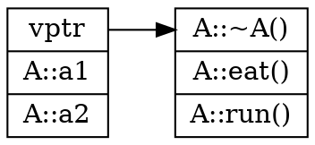
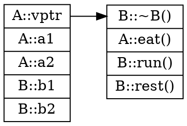
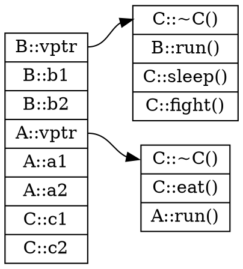
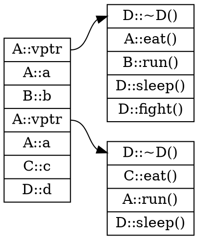
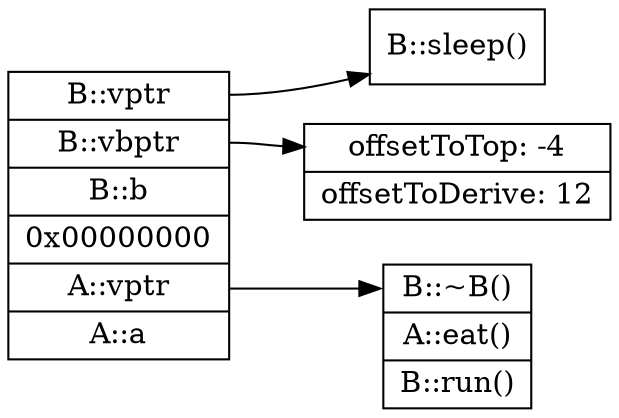
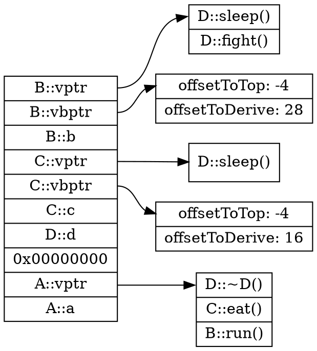

<!-- @import "[TOC]" {cmd="toc" depthFrom=1 depthTo=6 orderedList=false} -->
<!-- code_chunk_output -->

1. [无虚函数的简单对象](#无虚函数的简单对象)
   1. [没有继承的情况](#没有继承的情况)
   2. [简单继承](#简单继承)
2. [有虚函数无虚继承的情况](#有虚函数无虚继承的情况)
   1. [没有继承的情况](#没有继承的情况-1)
   2. [单继承](#单继承)
   3. [多继承非菱形继承](#多继承非菱形继承)
   4. [菱形继承](#菱形继承)
3. [虚继承](#虚继承)
   1. [简单继承](#简单继承-1)
   2. [菱形继承](#菱形继承-1)

<!-- /code_chunk_output -->
# 无虚函数的简单对象

## 没有继承的情况

```c++
class A
{
public:
    A():a(1),b(2){}
    ~A(){}
    void fun(){}
    static void count(){}
    static int total;
private:
    int a;
    int b;
};
```

对象布局：

| A    |
| ---- |
| A::a |
| A::b |

- 成员函数，静态变量，静态函数是全局共享的。
- 成员变量在内存中的顺序与声明顺序一致。

## 简单继承

```c++
class A
{
public:
    A():a(1),b(2){}
    ~A(){}
    void fun(){}
    static void count(){}
    static int total;
private:
    int a;
    int b;
};

class B 
{
public:
    B(){}
    ~B(){}
    void Bfun(){}
private:
    int c;
    int d;
};

class C :public B,public A
{
public:
    C():B(),A(){}
    ~C(){}
    void Cfun(){}
private:
    int e;
};
```

C的对象布局：

| C    |
|------|
| B::c |
| B::d |
| A::a |
| A::b |
| C::e |

# 有虚函数无虚继承的情况

## 没有继承的情况 

```c++
class A
{
public:
    A(){}
    virtual ~A(){}
    virtual void eat(){}
    virtual void run(){}
private:
    int a1;
    int a2;
};
```



- 虚表中存放函数入口地址
- 存放顺序与声明顺序一致

## 单继承

```c++
class A
{
public:
    A() {}
    virtual ~A() {}
    virtual void eat() {}
    virtual void run() {}
private:
    int a1;
    int a2;
};

class B:public A
{
public:
    B() {}
    virtual ~B() {}
    virtual void rest() {}
    virtual void run() {}
    virtual void sleep(){}
private:
    int b1;
    int b2;
};
```



- 对于那些被重写了的函数，在父类的虚表中会将对应的函数地址更新成子类的函数的地址 （多态实现核心）
- 子类新定义的虚函数会按定义顺序被添加到父类虚表末尾

## 多继承非菱形继承

```c++
class A
{
public:
    A() {}
    virtual ~A() {}
    virtual void eat() {}
	virtual void run() {}
private:
	int a1;
	int a2;
};

class B
{
public:
	B() {}
	virtual ~B() {}
	virtual void run() {}
    virtual void sleep() {}

private:
	int b1;
	int b2;
};

class C:public B,public A
{
public:
	C():B(),A() {}
	virtual ~C() {}
	virtual void eat() {}
	virtual void sleep() {}
	virtual void fight() {}
private:
	int c1;
	int c2;
};
```


- 两个父类都有虚表指针。
- 对于重写的函数仍然会在对应点虚表中进行更新。
- 对于子类新定义的函数只会添加在主基类的虚表末尾，即`C::fight`只存在B的虚表，不存在于A的虚表

## 菱形继承
```C++
class A
{
public:
	A() {}
	virtual ~A() {}
	virtual void eat() {}
	virtual void run() {}

private:
	int a;
};

class B:public A
{
public:
	B():A() {}
	virtual ~B() {}
	virtual void run() {}
	virtual void sleep() {}
	

private:
	int b;
};

class C :public A
{
public:
	C() : A() {}
	virtual ~C() {}
	virtual void eat() {}
	virtual void sleep() {}

private:
	int c;
};

class D :public B,public C
{
public:
	D() : B(),C() {}
	virtual ~D() {}
	virtual void sleep() {}
	virtual void fight() {}

private:
	int d;
};
```

- A在D中有两份拷贝。
- 新增的函数依然只会在位于最上方的虚表指针所指的虚表更新。
- 访问基类成员时可能会歧义。语句`d.eat();`会在编译时期报错，应指定源:`d.B::eat();d.C::eat();`

# 虚继承

## 简单继承

```c++
class A
{
public:
	A() {}
	virtual ~A() {}
	virtual void eat() {}
	virtual void run() {}

private:
	int a;
};

class B:virtual public A
{
public:
	B():A() {}
	virtual ~B() {}
	virtual void run() {}
	virtual void sleep() {}
	

private:
	int b;
};
```


- 如果子类定义了新的虚函数，则为子类生成一个虚表并将虚表指针置于对象首部，该虚表中只存放子类新定义的虚函数地址
- 虚继承下，将生产一个虚基类表指针，该表存放两个数据,分别为offsetToTop,offsetToDerive
  - offsetToTop：虚基类表指针到当前对象首部的偏移量，如果对象有虚表指针，则值为-4，反之为0。
  - offsetToDerive：虚基类表指针到基类对象的偏移量，在该例中为B::vbptr到A::vptr的偏移量。
- 父类在对象的尾部
- 子类与父类用0隔开
- 子类新定义的虚函数不再添加到父类虚表

## 菱形继承

```c++
class A
{
public:
	A() { a = 1; }
	virtual ~A() {}
	virtual void eat() {}
	virtual void run() {}

private:
	int a;
};

class B:virtual public A
{
public:
	B():A() { b = 2; }
	virtual ~B() {  }
	virtual void run() {}
	virtual void sleep() {}
	

private:
	int b;
};

class C :virtual public A
{
public:
	C() : A() { c = 3; }
	virtual ~C() {}
	virtual void eat() {}
	virtual void sleep() {}

private:
	int c;
};

class D :public B,public C
{
public:
	D() : B(), C() { d = 4; }
	virtual ~D() {  }
	virtual void sleep() {}
	virtual void fight() {}

private:
	int d;
};
```



- 子类与共有的父类间有一个0x00000000。
- 此例子中：B,C虚继承于A，D普通继承于A。
- B，C各自拥有自己的虚表指针，D则无。
- B,C相对于A新定义的虚函数放在各自的虚表中，D相对B,C新定义的虚函数放在主父类的虚表中，即B的虚表。


